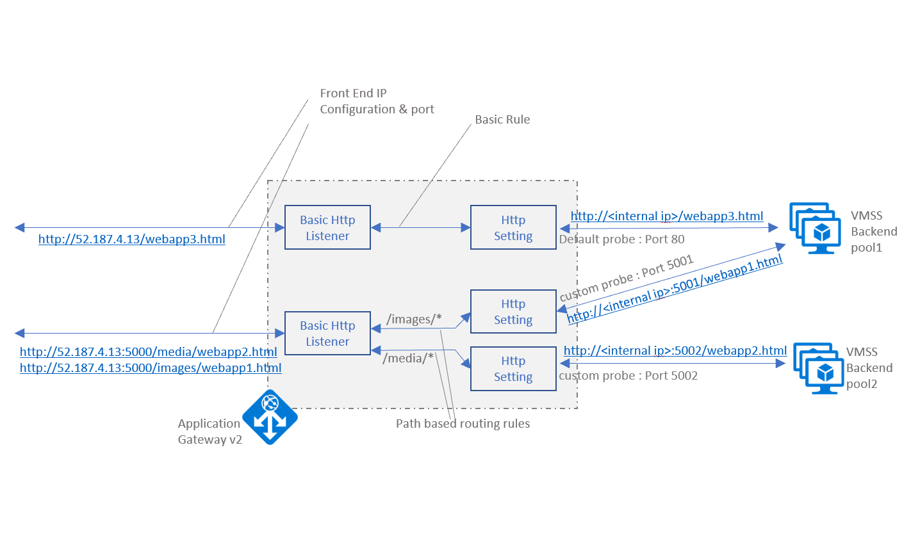

# ARM Templates to deploy Application Gateway v2 for L7 Load balancing to existing VMSS

This ARM Template deploys the following architecture to Azure. 

- Deploy to Availability Zones

- Deploy to an existing Subnet & VNet

- Add Basic Listener, multiple Front End IP Configurations on different ports

- Add Basic Routing and URL based routing

- Add custom probes on the Back End Pools

## Virtual Machine Scale Set (Linux) Deployment to a new VNet

Refer to Template file AppGateway_vmss_v2.json

> [!NOTE]
> The Template does not cover adding the existing VMSS to a Back End pool of the App Gateway being deployed through this template. CLI or PowerShell or Azure Portal could be used for that
This Template does not cover deploying the Web Applications to the VMSS
